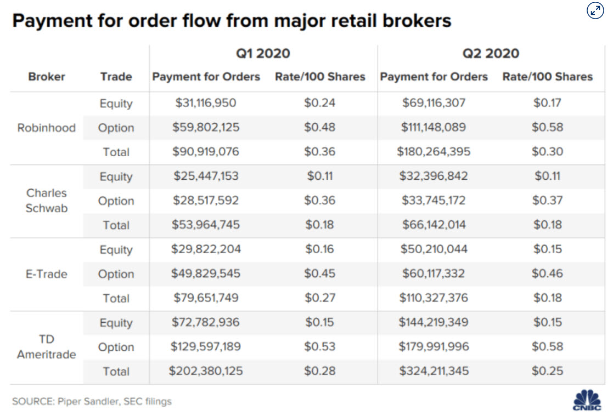

# Robinhood Markets, Inc. - Case Study

## Overview & Origin

Robinhood was founded in 2013 with a mission to provide 'everyone' with the ability to invest in financial markets. The two founders, Vladimir Tenev and Baiju Bhatt, leveraged their experience working for New York high frequency trading firms to develop the Robinhood platform. Tenev and Bhatt wanted to provide an investing solution that was easy to use and inexpensive for customers. At the time, many traditional investing platforms required minimum deposits of several thousand dollars and charged fees of up to $10 per trade, even though the actual cost per trade to them was only a fraction of a penny. The founders envisioned a platform that would ease the barrier of entry for investing in the market.

Initial attempts to raise money for the venture were unsuccessful. After about 75 investor pitches, the founders were able to find a few venture capitalists that were willing to bet $3M on their idea. In 2017, Robinhood was able to raise $110M, at a valuation of $1.3B from, from DST Global, Greenoaks Capital and Thrive Capital. They raised an additional $363M in a round of financing led by DST Global. By 2015, the company was valued at approximately $5.6B. They managed to raise another $280M from Sequoia Capital in 2019 at a valuation of $8.3B.

## Business Activities

Robinhood's primary target audience,younger investors, want an easy to use app-based interface with no minimum account balance requirement and no fees. The company was able to reduce friction and costs, while enhancing accessibility. Robinhood initally began offering commission-free trading for stocks and ETFs. In 2016, they introduced 'instant deposits' for incoming funds transfers of up to $1,000, allowing customers to immediately put the funds to use instead of waiting several days for the ACH transfer to clear. Later that same year, they began offering a 'Gold' service that provided higher limits on instant deposits as well as margin trading.

Robinhood uses an array of modern web technologies and cloud platforms to deliver their solutions. React is used for front-end development, while a number of SQL-based solutions such as Spark, Presto, PostgreSQL and MySQL are used on the backend. Their data stack is hosted in AWS, where they use an ELK stack for search and analytics. Robinhood also uses Redshift to detect instances of fraud and money laundering. Although the company has long touted their technological innovation and design, they have suffered several embarrassing outages. The founders have blamed unprecedented market volatility and a flurry of new account requests for the issues, however, some remain skeptical of those explanations. Their competitors offer much more comprehensive investing options, better analytics, and now commission free trading as well as fractional share investing. As Robinhood investors mature and expect more advanced features and options, it will be interesting to see if the company can keep pace and whether it even wants to try to replicate the services offered by its competitors.

## Landscape

Being in the retail investing sector, Robinhood has had to compete with heavyweights such as Charles Schwab, TD Ameritrade and E-Trade. Although all of these brokerages have been around longer, offer more mature solutions and and a greater variety of investing options, Robinhood has managed to capture the segment of the market that values simplicity in investing. Commissions, which have been the bread and butter of brokerage firms, were the most notable differentiator. By offering commission free trading, Robinhood was able to appeal to a segment of the market that grew up expecting free online services and simple application interfaces.

Over the past 10 years, the big players in this sector have focused on two things: 1) technology, and 2) attracting active traders, who provide much more fee income than passive investors. Back in 2009, TD Ameritrade acquired technology startup Think or Swim for $606M to provide their customers with a more modern, feature rich trading platform. Although Think or Swim has been regarded as a robust trading platform for many years, TD Ameritrade has been slow to innovate it. Plus, many new investors shy away from the desktop version of the platform due to its complexity and the computing resources required to run it. 

Brokerage firms generate income from trading/transaction fees on equities, options and futures, as well as advising services. Robinhood has already led the industry into a no-commission model for stock trading. They now also offer no-commission options trading, however, they are required to pass along FINRA regulatory transaction fees to customers. The fee is $0.000119 per share for equity sell orders and $0.002 per share for options sells. The charge is rounded up to the nearest penny and never exceeds $5.95. If Robinhood decides to enter the futures trading sector, it will add even more pressure on incumbents to lower their fees, which can be as high as $7 roundtrip to trade the popular S&P 500 e-mini contract. Futures however are traded on four big exchanges: CME, CBOT, NYMEX and COMEX. Since those exchanges essentially have a monopoly on trading futures contacts for equities, bonds, commodities and other derivatives, they can determine the fee structure. If Robinhood were to expand into futures, it would be difficult to not pass along those fees to their customers. On the one hand, it would make more sense for Robinhood to avoid the futures market due to its fee structure, higher leverage and greater volatility. On the other hand, as Robinhood customers get more comfortable with active trading, they will likely want expanded trading options. The introduction of micro futures contracts in 2019 and micro future options in 2020 by the exchanges is intended to draw in smaller traders and generate more fee income for the CME Group. At some point, Robinhood will have to decide whether they are willing to expose their customer to higher stakes markets, like futures, or risk losing them to competitors that already offer solutions in those areas.

## Results

Robinhood has become a serious competitor to well established industry leaders. They have managed to capture a segment of the market that traditional brokerages have struggled to recruit. Their clean, simple interface and innovative investment options, such as fractional shares, have made it easier for customers to invest. Futhermore, they have turned investing into a social affair by incentivizing existing customers to invite their friends and family to join by offering a free stock for every invitee that funds an account.

The company managed to add 100,000 users in their first month. By 2018 they had already surpased E-Trade with 4M brokerage accounts. After just 6 years in operation, Robinhood passed 10M users in late 2019. According to an SEC filing this year, Robinhood doubled the money ($180M) they make from selling their customers' order flows to high frequency trading firms. The majority of that increase came from their options trading service. Robinhood manages to make about $0.17 per 100 shares of order flow information they provide to market makers. Charles Schwab on the other hand makes about $0.11. Robinhood tied with TD Ameritrade at $0.58 per 100 shares of options order flow that is sold. E-Trade and Schwab earned $0.46 and $0.37, respectively.

## Recommendations

The two areas where I believe Robinhood should consider focusing on are Environment, Social and Corporate Governance (ESG) investing and robo-advisors. Socially responsible investing is already popular with Robinhood's core customer base, Millennials. As of 2018 investors held $11.6T in assets that meet ESG criteria, which is an increase of $8.1T from just two years earlier. As the line between investing and social causes continues to blur, I think brokerages that are able to provide their customers with socially conscious investing options will be well positioned to flourish. I believe that robo-adivising service may be an even bigger hit with Robinhood customers. Robo-advisors can help make the investing process both easier and more automatic, two traits that Robinhood customers seem to value. As younger investors move into higher income brackets and begin building wealth, I believe they will want an intelligent, data-driven solution to help them make better investing decisions. Since Robinhood does not currently employ an army of human advisors, I think they have an excellent opportunity to design and build fully autonomous robo-advising solutions that can meet their customers' needs, whether its focusing on ESG, a future home purchase, retirement or a college savings plan.

## References

https://money.usnews.com/investing/investing-101/articles/how-robinhood-changed-an-industry

https://en.wikipedia.org/wiki/Robinhood_(company)

https://robinhood.com/us/en/support/getting-started/about-robinhood/

https://www.businessinsider.com/robinhood-app-vlad-tenev-founder-free-stock-trading-valuation-2017-7

https://www.huffpost.com/entry/startup-insider-the-story_b_7976446

https://www.intermix.io/blog/how-robinhood-built-their-data-pipeline-with-amazon-redshift/#:~:text=Robinhood's%20data%20stack%20is%20hosted,data%20is%20visualized%20through%20Kibana.

https://www.thestreet.com/investing/robinhood-founders-explain-what-caused-app-to-crash

https://techcrunch.com/2020/03/03/robinhood-outage-cause/?guccounter=1&guce_referrer=aHR0cHM6Ly93d3cuZ29vZ2xlLmNvbS8&guce_referrer_sig=AQAAAMK6YzPJz_Sy4UzUMIZd88cB9lqSN_n8qvoeUsayTnMoPROweRr7nEFYtxtqlGftevkvTYcwcFufb0Rko5hbCMnWZiZeHuR31b98DxFNknc639KEGZMsNDOfzlR_PPwG4Opnr9iBq19PMWDCE61F8OuHH_bHS_ytQq1mHkz5vrcb#:~:text=Instead%2C%20the%20co%2DCEOs%20write,failure%20of%20our%20DNS%20system.%E2%80%9D

https://www.marketwatch.com/story/td-ameritrade-to-buy-thinkorswim-for-606-million

https://www.cnbc.com/2020/08/13/how-robinhood-makes-money-on-customer-trades-despite-making-it-free.html

https://www.investopedia.com/terms/e/environmental-social-and-governance-esg-criteria.asp